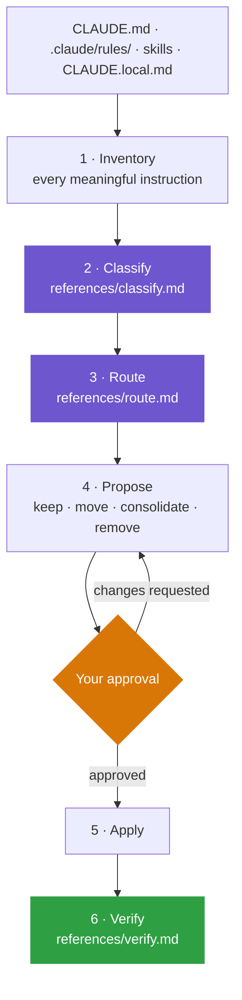

<div align="center">

# AI-Contexture

**A Claude Code skill that routes every project instruction to the cheapest place it can still do its job.**

Your `CLAUDE.md` is loaded on every single turn. Most of what lives there doesn't need to be.


<a href="#install">Install</a> · <a href="#usage">Usage</a> · <a href="#how-it-works">How it works</a> · <a href="#classification">Classification</a> · <a href="#routing">Routing</a> · <a href="#guarantees">Guarantees</a>

</div>

---

> [!WARNING]
> **Beta — version 0.1.0.**
> This is an early release. The classification taxonomy, routing destinations, and
> generated file layout may change without a migration path. The skill rewrites the
> context files that steer your agent, so review every proposal before approving it and
> keep your work in version control. Do not run it against a repo with uncommitted
> context changes.

---

## The problem

Everything in `CLAUDE.md` is paid for on every turn of every session — whether or not
that turn has anything to do with it. So context files drift into one of two failure
modes:

- **Bloated** — release checklists, architecture essays, and language-specific lint rules sit in the always-loaded path, burning tokens and diluting attention on unrelated tasks.
- **Starved** — someone trims it aggressively, and the agent loses instructions it genuinely needed, producing retries and rework that cost more than the tokens saved.

`ai-contexture` treats this as a **placement** problem, not a size problem. Every
instruction keeps its behavioral intent; it just moves to the tier that loads it when
it's actually relevant.

> The objective is **better context, not merely less context.**

---

## How it works

The skill inventories every meaningful instruction in your project's context files,
assigns each one a class, routes it to a destination, and shows you the plan. Nothing
is written until you approve it.



Discovery and classification run in an **isolated subagent** (`context: fork`), so the
raw scan of your repo never lands in your main conversation. Only the short proposal
comes back.

---

## Install

**Requirements:** Claude Code with skill support. No runtime, no package manager, no dependencies — the skill is four Markdown files.

### For every project (personal skills)

```bash
git clone https://github.com/abraxarion/ai-contexture.git
mkdir -p ~/.claude/skills
rm -rf ~/.claude/skills/ai-contexture    # clear any previous install
cp -r ai-contexture/skills/ai-contexture ~/.claude/skills/ai-contexture
```

### For one project (project skills)

```bash
git clone https://github.com/abraxarion/ai-contexture.git /tmp/ai-contexture
mkdir -p .claude/skills
rm -rf .claude/skills/ai-contexture      # clear any previous install
cp -r /tmp/ai-contexture/skills/ai-contexture .claude/skills/ai-contexture
```

Commit it if you want the whole team to have it, or add
`.claude/skills/ai-contexture/` to `.gitignore` if you don't.

Both snippets are safe to re-run — that is also how you upgrade. The `rm -rf` line
matters: without it, a second `cp` nests the skill inside itself and Claude Code
silently stops seeing it.

### Verify the install

```bash
find ~/.claude/skills/ai-contexture -type f | sort
```

Expected — exactly four files, nothing else:

```text
~/.claude/skills/ai-contexture/SKILL.md
~/.claude/skills/ai-contexture/references/classify.md
~/.claude/skills/ai-contexture/references/route.md
~/.claude/skills/ai-contexture/references/verify.md
```

Restart Claude Code, or start a new session, to pick up the skill.

---

## Usage

Open Claude Code in the project you want to optimize and invoke the skill:

```text
/ai-contexture
```

Or just describe the goal — the skill's description triggers it automatically:

```text
Our CLAUDE.md has grown to 300 lines. Optimize the context files in this project.
```

You'll get back a proposal grouped by action — what stays, what moves where, what
consolidates, and what's a removal candidate — with the material quality or cost effect
of each. **Approve it, amend it, or reject it.** Only approved changes are applied, and
the result is checked against the verification list before the skill reports completion.

### Worked example

<table>
<tr><th>Before — everything always loaded</th></tr>
<tr><td>

```markdown
# CLAUDE.md

Prefer Graft for repo queries; avoid broad grep and large file reads.
Run cargo clippy after changing Rust code.
The release process is: update changelog, tag, build, sign, publish.
The project uses Rust.
Do not replace the Rust sidecar with Node.
Architecture details: the sidecar owns IPC because ...
```

</td></tr>
</table>

<table>
<tr><th>After — routed by class</th></tr>
<tr><td>

```text
CLAUDE.md                          CORE · loaded every turn
├── Prefer Graft for repo queries; avoid broad grep and large file reads.
└── Do not replace the Rust sidecar with Node.

.claude/rules/rust.md              PATH · loaded when touching Rust
└── Run cargo clippy after changing Rust code.

.claude/context/architecture.md    CONTEXT · loaded when the task needs it
└── The sidecar owns IPC because ...

.claude/skills/release/SKILL.md    WORKFLOW · loaded when releasing
└── Update changelog → tag → build → sign → publish.

(removed)                          DERIVABLE · Cargo.toml is authoritative
└── "The project uses Rust."
```

</td></tr>
</table>

Note what **stayed**. `Prefer Graft for repo queries` is three lines of always-loaded
context that prevents thousands of tokens of blind `grep` and whole-file reads later —
it earns its place. And `Do not replace the Rust sidecar with Node` expresses *intent*,
which no repo file can derive, so it is never a deletion candidate.

---

## Classification

Every meaningful instruction gets exactly one primary class. Judged by **expected
value, not instruction length**.

| Class | Meaning |
| :--- | :--- |
| `CORE` | Needed globally, or before context acquisition happens |
| `PATH` | Relevant to predictable files or directories |
| `CONTEXT` | Relevant only to a particular task or domain |
| `WORKFLOW` | An ordered or repeatable procedure |
| `LOCAL` | User- or machine-specific |
| `DERIVABLE` | Reliably available from authoritative repo files |
| `DUPLICATE` | Equivalent guidance already exists elsewhere |
| `CONFLICT` | Contradicts another requirement |

Instructions that improve context quality, cache hits, token use, tool choice, latency,
or cost are classified `CORE` when they must affect behavior *before* more context is
loaded. Getting the agent to search well is worth more than any single fact you could
have put in its place.

## Routing

| Class | Destination | When it loads |
| :--- | :--- | :--- |
| `CORE` | `CLAUDE.md` | Every session |
| `PATH` | `.claude/rules/` | When work touches that area |
| `CONTEXT` | `.claude/context/` | When the task needs that topic |
| `WORKFLOW` | a skill | When the workflow runs |
| `LOCAL` | `CLAUDE.local.md` | Every session, untracked |
| `DERIVABLE` | removal candidate | Never — read from the source of truth |
| `DUPLICATE` | consolidate | Merged into the canonical copy |
| `CONFLICT` | human decision | Escalated to you |

**Routing rules**

1. Prefer conditional loading over always-loaded context.
2. Keep `CLAUDE.md` for high-value early instructions only.
3. Never use `@file` imports for lazy context — they load eagerly and defeat the point.
4. Keep a routing hint shorter than the context it routes to.
5. Create only the files the project actually needs.
6. Preserve when uncertain.

---

## Guarantees

<table>
<tr><td width="50%" valign="top">

**Nothing moves without approval**:
The skill proposes; you decide. No file is modified before you say so.

**Unique intent is preserved**: 
Instructions are moved, not deleted. Deletion requires high confidence and explicit sign-off.

</td><td width="50%" valign="top">

**Idempotent**: 
Run it twice and the second run makes no changes. It won't churn an already-optimized project.

**Judged by total session cost**: 
Startup context, context acquisition, cache misses, tool calls, latency, and rework — not `CLAUDE.md` line count.

</td></tr>
</table>

Every applied change is checked against six conditions before completion:

1. Every unique instruction was preserved, or explicitly approved for removal.
2. Moved instructions remain discoverable when needed.
3. Typical task context is more relevant, precise, and brief.
4. Always-loaded context decreased, or clearly justifies its cost.
5. No unnecessary duplicate, stale, or conflicting guidance was introduced.
6. Re-running the skill would make no unnecessary changes.

If any check fails, routing is fixed before the skill reports done.

---

## Not in v1

Deliberately out of scope, so the skill stays four readable files:

`metadata manifest` · `telemetry` · `compiler executable` · `automatic token accounting` · `scoring formulas` · `large instruction taxonomies` · `deletion without review`

The three reference files are shaped to become compiler stages later
(`classify.md → classifier`, `route.md → planner`, `verify.md → verifier`) without a
redesign — but human-readable Markdown stays the canonical interface.

---

## Repo layout

```text
ai-contexture/                 ← repo root
├── skills/
│   └── ai-contexture/         ← the skill; this is what you install
│       ├── SKILL.md           orchestrates inspect → classify → route → propose → apply → verify
│       └── references/
│           ├── classify.md    owns the taxonomy
│           ├── route.md       owns the destinations
│           └── verify.md      owns the post-change checks
├── docs/superpowers/
│   ├── specs/2026-08-25-ai-contexture-v1-design.md    intent — authoritative
│   └── plans/2026-08-25-ai-contexture-v1-implementation-plan.md
└── CLAUDE.md                  this repo is routed by its own model
```

`SKILL.md` names the workflow and delegates every definition to a reference file. Each
reference owns exactly one decision, and nothing is duplicated between them — the same
discipline the skill applies to your project.

## Contributing

Intent lives in the spec, execution lives in the plan. **Change the spec before changing
behavior.** Read `.claude/rules/docs.md` before writing under `docs/superpowers/`, and
`.claude/rules/skills.md` before authoring or editing a skill.

## License

MIT © 2026 abraxarion — see [LICENSE](LICENSE).

<div align="center">
<sub>Built for <a href="https://claude.com/claude-code">Claude Code</a> · v0.1.0 beta</sub>
</div>
